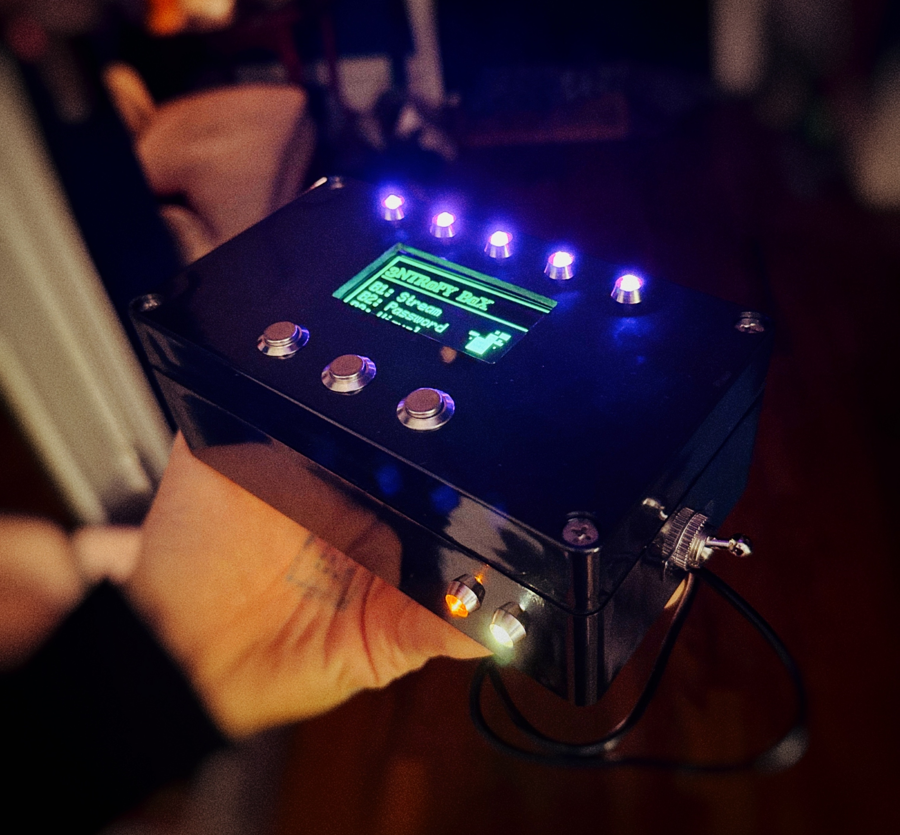
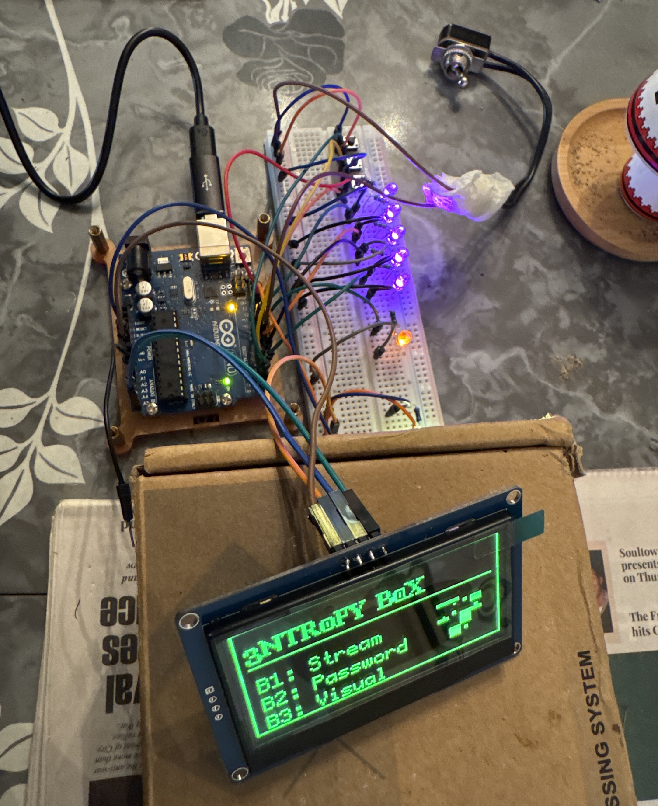
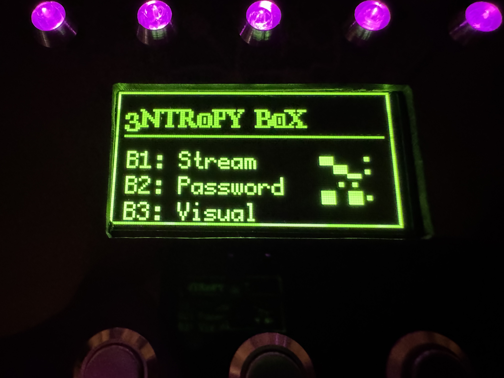
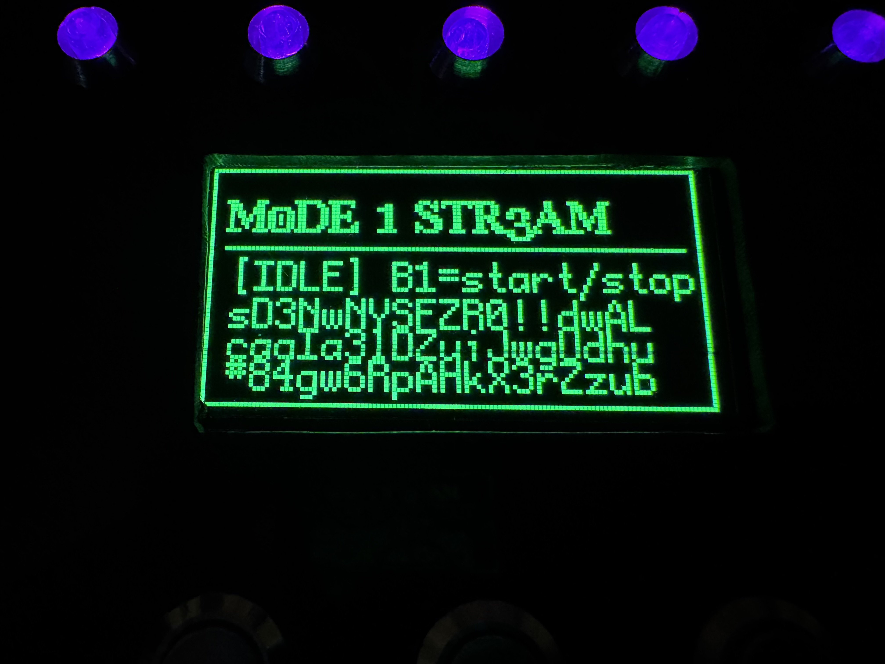
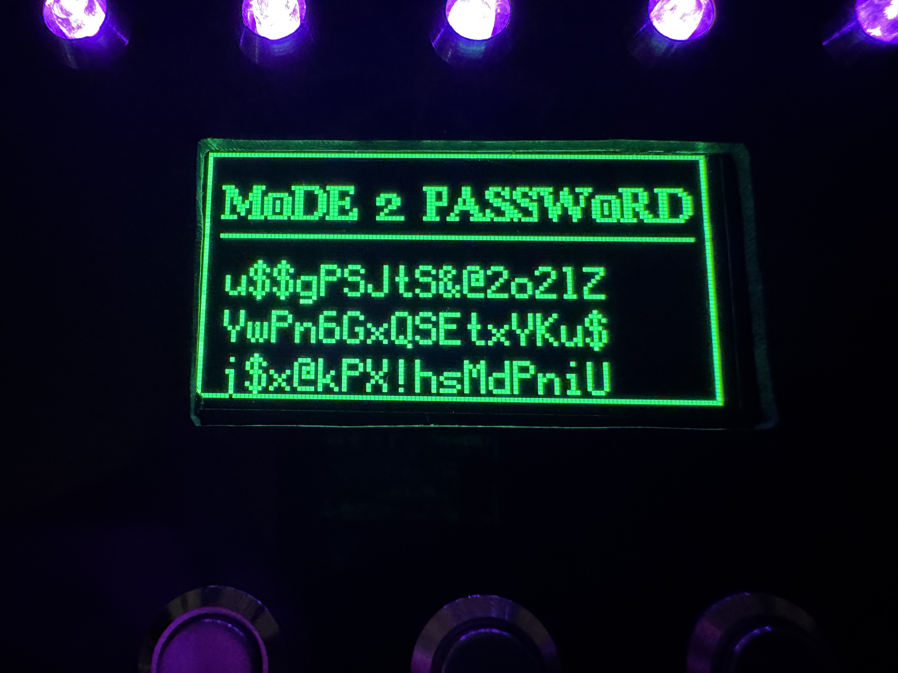
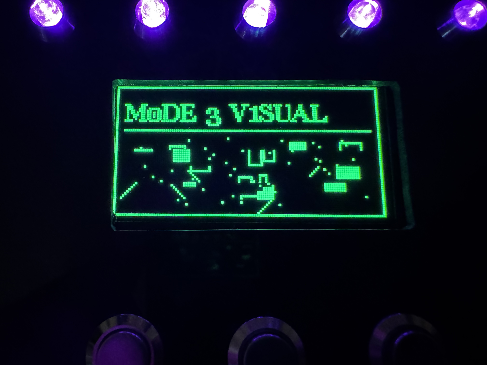
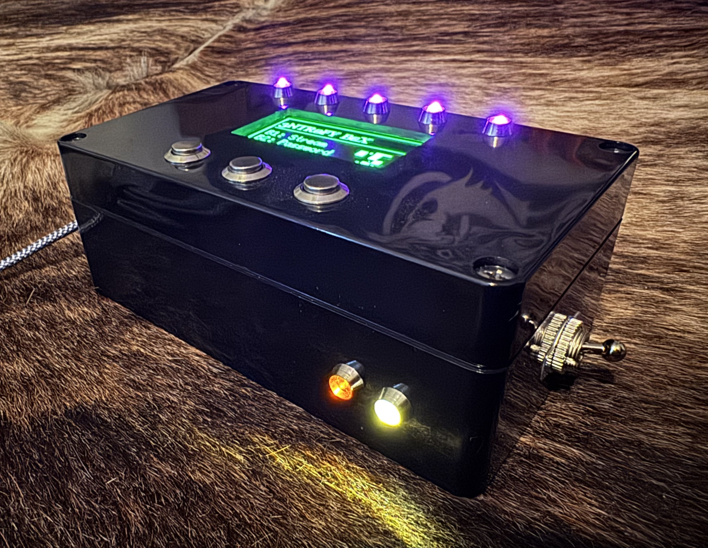
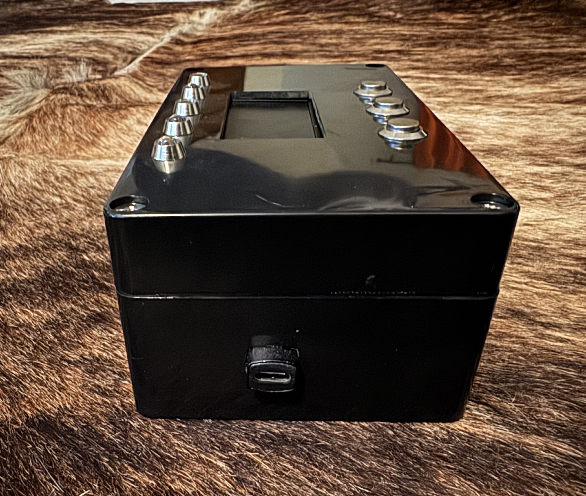

# Entropy Box

  

---

  

Prototype phase before enclosure, during breadboard testing and UI development.

---

Entropy Box is a handheld random output device built on an Arduino Uno.

It collects analog noise, timer jitter, and button timing data, mixes them into an entropy pool, and uses that pool to generate output.

It has three operating modes:

- **Stream** — continuous random character generation  
- **Password** — generates 16-character passwords  
- **Visual** — renders randomized abstract patterns  

The current build uses:

- 128x64 SSD1309 OLED display
- five top-mounted LEDs
- three stainless steel momentary buttons
- side-mounted toggle switch
- white and orange status LEDs
- side-mounted USB-C power

---

## How It Works

Entropy Box uses multiple entropy sources:

- floating analog input (A0)
- repeated analog sampling
- microsecond timer jitter
- millisecond timer state
- button press timing
- button hold duration

These values are mixed into an internal entropy pool and used to reseed the random generator.

Output is influenced by both electrical noise and user interaction timing.

---

## Modes

### Stream

Outputs a continuous stream of randomized characters.

Can be started and stopped manually.

Used for observing live output over time.

---

### Password

Generates a new 16-character password each time it is activated.

Stores the last three generated passwords on screen.

---

### Visual

Builds randomized visual compositions from:

- pixel noise
- blocks
- diagonal lines

Each activation generates a new pattern.

---

## Hardware

Built on:

- Arduino Uno
- SSD1309 OLED
- 3 momentary pushbuttons
- 5 LEDs
- 1 toggle switch
- USB-C power adapter
- project enclosure

The final layout was designed around the physical dimensions of the enclosure and available hardware.

The OLED runs in paged buffer mode to reduce SRAM use and improve stability.

---

## Documentation

- [Hardware](docs/HARDWARE.md)
- [Wiring](docs/wiring/WIRING.md)
- [Wiring Diagram](docs/wiring/WIRING_DIAGRAM.md)
- [Software](docs/SOFTWARE.md)
- [Build Log](docs/BUILD_LOG.md)

---

## Gallery

<table align="center">
<tr>
<td></td>
<td></td>
<td></td>
</tr>
<tr>
<td></td>
<td></td>
<td></td>
</tr>
</table>

---

## License

[MIT License](LICENSE)

---

  Built under Feral Engineering.
   
  

